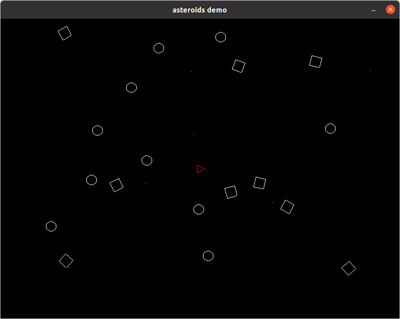

# Asteroids



## Dependencies

* [SDL2 + SDL2_gfx](https://github.com/Rust-SDL2/rust-sdl2)
* [cgmath](https://github.com/rustgd/cgmath)
* [rand](https://github.com/rust-random/rand)

## Component(s)

### Position

Position is defined by a position (or location) and an angle :
```rust
struct Position {
    position: Vector2<f32>,
    angle: Deg<f32>,
}
```

We need to implementation Default :
```rust
impl Default for Position {
    fn default() -> Self {
        Self {
            position: Vector2::new(0.0, 0.0),
            angle: Deg::zero(),
        }
    }
}
```

Each Component must implemente [`entity_system::Component`] and Position are stored in [`entity_system::BasicVecStorage`] :
```rust
impl entity_system::Component for Position {
    type Storage = entity_system::BasicVecStorage<Self>;
}
```

Last method is used to compute Matrix3 from position and angle :
```rust
impl Position {
    pub fn get_matrix(&self) -> Matrix3<f32> {
        let tse_matrix = Matrix3::from_translation(self.position);
        let rot_matrix = Matrix3::from_angle_z(self.angle);
        tse_matrix * rot_matrix
    }
}
```

### Velocity

Velocity is very similair to Position :
```rust
struct Velocity {
    position: Vector2<f32>,
    angle: Deg<f32>,
}
```

same Default and Component implementation.

### Shape

Shape defines the shape of object to draw :
```rust
#[derive(PartialEq)]
enum Shape {
    Circle,
    Square,
    Triangle,
    Bullet,
}
```

Default and Component implementation are common :
```rust
impl Default for Shape {
    fn default() -> Self {
        Self::Circle
    }
}

impl entity_system::Component for Shape {
    type Storage = entity_system::BasicVecStorage<Self>;
}
```

## Declare EntityManager

We have 3 component (Position, Velocity and Shape) :
```rust
entity_system::create_entity_manager_component!(EMC {
    Position,
    Velocity,
    Shape
});

type EntityManager = entity_system::EntityManager<EMC>;
type Query = entity_system::Query<EMC>;
type Entity = entity_system::Entity;
```

## Initialize

Create 20 static targets (10 circles and 10 squares) :
```rust
for i in 0..20 {
    let entity = entity_manager.create_entity();

    entity_manager.add_component_with::<Position, _>(entity, |position| {
        position.position.x = rand::random::<f32>() * 800.0;
        position.position.y = rand::random::<f32>() * 600.0;
        position.angle = Deg(rand::random::<f32>() * 360.0);
    });

    entity_manager.add_component_with::<Shape, _>(entity, |shape| {
        if i % 2 == 0 {
            *shape = Shape::Circle;
        } else {
            *shape = Shape::Square;
        }
    });
}
```

Create the starship :
```rust
let starship_entity = entity_manager.create_entity();

entity_manager.add_component_with::<Position, _>(starship_entity, |position| {
    position.position.x = 400.0;
    position.position.y = 300.0;
    position.angle = Deg::zero();
});

entity_manager.add_component_with::<Shape, _>(starship_entity, |shape| {
    *shape = Shape::Triangle;
});

entity_manager.add_component::<Velocity>(starship_entity);
```

## Control or event pool

We want to :
* quit the program if the window is closed or Escape is pressed
* Increase (Up) or Decrese (Down) position velocity the starship in angle direction
```rust
// Up
update_velocity_position(&mut entity_manager, starship_entity, Vector2::new(0.0, 1.0));

// definition of update_velocity_position
fn update_velocity_position(
    entity_manager: &mut EntityManager,
    entity: Entity,
    delta_position: Vector2<f32>,
) {
    let position = entity_manager.get_component::<Position>(entity);
    let delta = (Matrix3::from_angle_z(position.angle) * delta_position.extend(1.0)).truncate();
    entity_manager.update_component_with::<Velocity, _>(entity, |velocity| {
        velocity.position += delta;
        velocity.position.x = velocity.position.x.min(5.0).max(-5.0);
        velocity.position.y = velocity.position.y.min(5.0).max(-5.0);
    });
}
```
* Increase angle velocity with Left and Right
```rust
// Right
update_velocity_angle(&mut entity_manager, starship_entity, Deg(5.0));

// definition of update_velocity_angle
fn update_velocity_angle(
    entity_manager: &mut EntityManager,
    entity: Entity,
    delta_angle: Deg<f32>,
) {
    entity_manager.update_component_with::<Velocity, _>(entity, |velocity| {
        velocity.angle += delta_angle;
    });
}
```
* Fire a bullet on space
```rust
let bullet = entity_manager.create_entity();
let matrix = entity_manager
    .get_component::<Position>(starship_entity)
    .get_matrix();
let center_pos = (matrix * Vector3::new(0.0, 0.0, 1.0)).truncate();
let start_pos = (matrix * Vector3::new(0.0, 10.0, 1.0)).truncate();
entity_manager.add_component_with::<Position, _>(bullet, |position| {
    position.position = start_pos;
});

entity_manager.add_component_with::<Velocity, _>(bullet, |velocity| {
    velocity.position = (start_pos - center_pos).normalize() * 6.0;
});

entity_manager.add_component_with::<Shape, _>(bullet, |shape| {
    *shape = Shape::Bullet;
});
```

## System(s)

### Move
We need a query to select entity with Position and Velocity :
```rust
let mut query_velocity = Query::new();
query_velocity
    .check_component::<Velocity>()
    .check_component::<Position>();
```

Update position 
```rust
for entity in entity_manager.iter(&query_velocity) {
    entity_manager.update_component_with::<Position, _>(entity, |position| {
        let velocity = entity_manager.get_component::<Velocity>(entity);

        position.position.x += velocity.position.x;
        position.position.y += velocity.position.y;
        position.angle += velocity.angle;
    });
}
```

### Hit between target and bullet
We need 2 queries. First to select target entity with position :
```rust
let mut query_target = Query::new();
query_target
    .check_component_by::<Shape, _>(|shape| -> bool {
        *shape == Shape::Square || *shape == Shape::Circle
    })
    .check_component::<Position>();
```
Second to select bullet with position :
```rust
let mut query_bullet = Query::new();
query_bullet
    .check_component_by::<Shape, _>(|shape| -> bool { *shape == Shape::Bullet })
    .check_component::<Position>();
```

Detect hit and remove them :
```rust
let mut delete_entities = Vec::new();
for bullet_entity in entity_manager.iter(&query_bullet) {
    let bullet_position = entity_manager
        .get_component::<Position>(bullet_entity)
        .position;
    for target_entity in entity_manager.iter(&query_target) {
        let target_position = entity_manager
            .get_component::<Position>(target_entity)
            .position;
        if (target_position - bullet_position).magnitude() < 10.0 {
            delete_entities.push(target_entity);
            delete_entities.push(bullet_entity);
        }
    }
}

delete_entities.iter().for_each(|entity| {
    entity_manager.delete_entity(*entity);
});
```

### Draw
We need a query to select entity with Shape and Position :
```rust
let mut query_drawable = Query::new();
query_drawable
    .check_component::<Shape>()
    .check_component::<Position>();
```

Draw :
```rust
for entity in entity_manager.iter(&query_drawable) {
    let position = entity_manager.get_component::<Position>(entity);
    let shape = entity_manager.get_component::<Shape>(entity);
    match *shape {
        Shape::Circle => {
            canvas.circle(position.position.x as i16, position.position.y as i16, 10, Color::WHITE)?;
        },
```